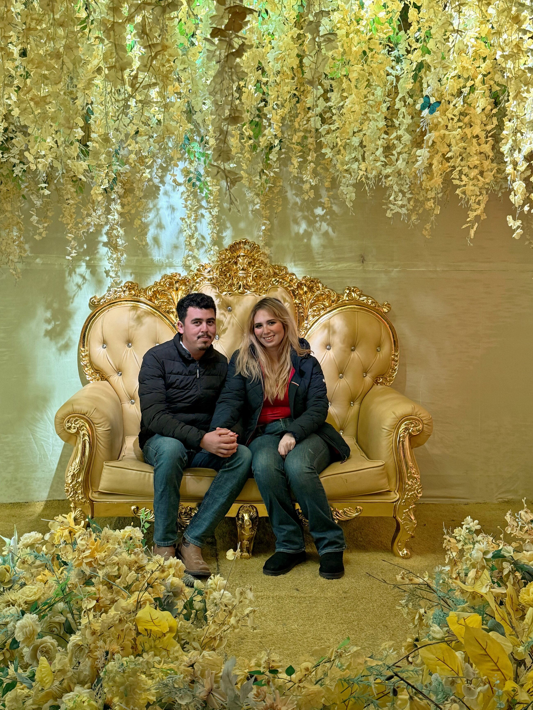
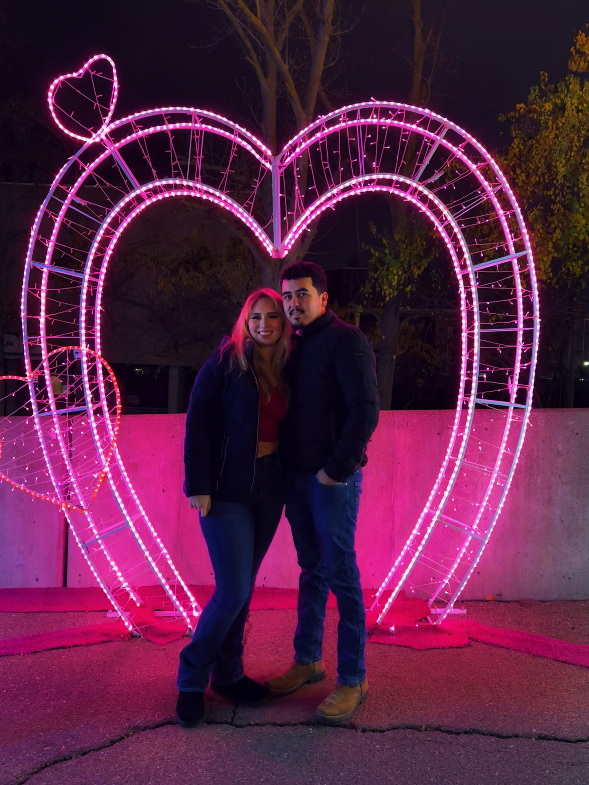
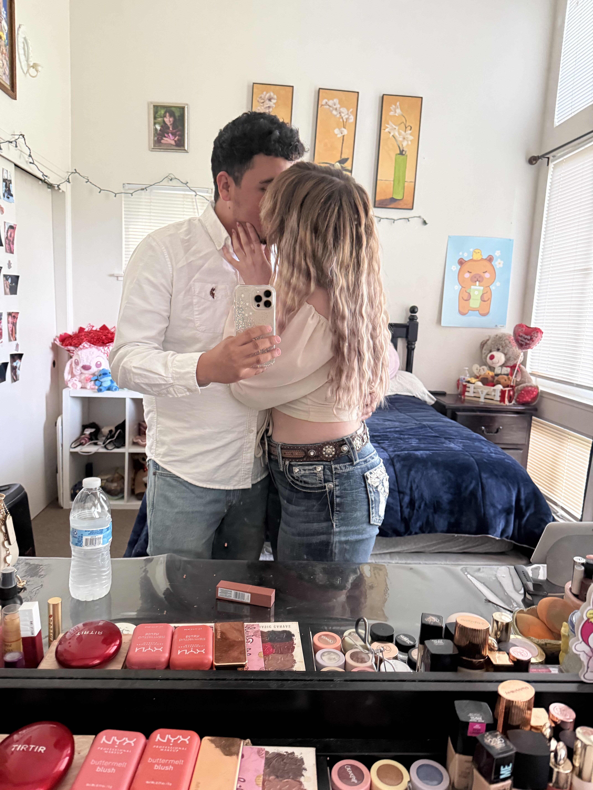

<!DOCTYPE html>
<html lang="es">
<head>
    <meta charset="UTF-8">
    <meta name="viewport" content="width=device-width, initial-scale=1.0">
    <title>Nuestra Boda - Fermín y Lizet</title>
    <link rel="preconnect" href="https://fonts.googleapis.com">
    <link rel="preconnect" href="https://fonts.gstatic.com" crossorigin>
    <link href="https://fonts.googleapis.com/css2?family=Alex+Brush&family=Cormorant+Garamond:ital,wght@0,400;0,600;1,400&family=Montserrat:wght@300;400&display=swap" rel="stylesheet">
    
    
</head>
<body>

    

        

            

            

            

        

        
Toca el sello de cera para abrir

    

    <main id="main-content">
        
        <svg class="botanical-decor top-left" viewBox="0 0 100 100">
            <path d="M10,90 Q30,60 50,20 T90,10 M50,20 Q40,30 30,25 Q45,15 50,20 M70,12 Q65,25 55,20 Q70,5 70,12" stroke="#c5a059" stroke-width="0.7" fill="none"/>
        </svg>
        <svg class="botanical-decor bottom-right" viewBox="0 0 100 100">
            <path d="M10,90 Q30,60 50,20 T90,10 M50,20 Q40,30 30,25 Q45,15 50,20 M70,12 Q65,25 55,20 Q70,5 70,12" stroke="#c5a059" stroke-width="0.7" fill="none"/>
        </svg>

        <section class="hero">
            
“Así que ya no son dos, sino uno solo. Por tanto, lo que Dios ha unido, que no lo separe el hombre”

            
            

                
Con la bendición de Dios y de nuestros padres

                
Rafael Puente Ramírez  |  Ricardo Rodríguez Cano

                
Josefina Palomares Zavala  |  Angelina Piña Piña

            

            

                Tenemos el honor de invitarlos a celebrar nuestra boda
            

            
            

                <h1>Fermín Rodríguez Piña</h1>
                

                    
                    y
                    
                

                <h1>Lizet Puente Palomares</h1>
            

            
            

                Sábado • 24 Octubre • 2026
            

            

                

                    
00<label>Días</label>

                    
00<label>Horas</label>

                    
00<label>Min</label>

                    
00<label>Seg</label>

                

            

        </section>

        <section class="slideshow-section">
            

                

                    
                

                

                    
                

                

                    
                

                

                    
                

                

                    
                

                <a class="prev" onclick="plusSlides(-1)">❮</a>
                <a class="next" onclick="plusSlides(1)">❯</a>
            

            

                
                
                
                
                
            

        </section>

        <section class="details">
            <h2 class="section-title">Detalles del Evento</h2>
            

                
                <a href="https://www.google.com/maps/place/St+James+Catholic+Church/@38.55494,-121.7509779,758m/data=!3m2!1e3!4b1!4m6!3m5!1s0x808529a344a5c52b:0xb55a3f7cec611723!8m2!3d38.55494!4d-121.748403!16s%2Fg%2F1vd3w03w?entry=ttu&g_ep=EgoyMDI2MDUyNy4wIKXMDSoASAFQAw%3D%3D" target="_blank" class="location-link">
                    
ST. JAMES CATHOLIC CHURCH

                    
1275 B St, Davis, CA 95616

                    📍 Ver Mapa y Direcciones
                </a>
                
                

                    
<strong>Misa:</strong> 12:00 PM

                    
<strong>Comida:</strong> 3:00 PM - 6:00 PM

                    
<strong>Baile:</strong> 6:00 PM - 10:00 PM

                

            

            

                
Padrinos de Velación

                
Salvador Puente Ramírez

                
Rocío Palomares Zavala

            

        </section>

    </main>

    
</body>
</html>
